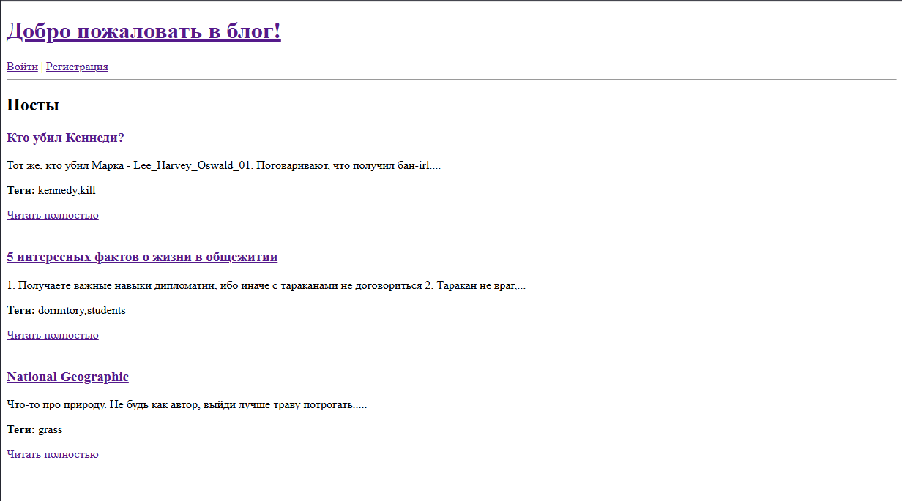
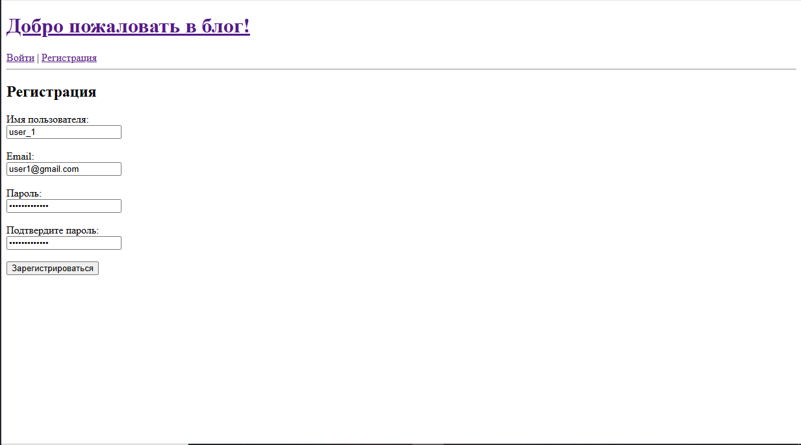
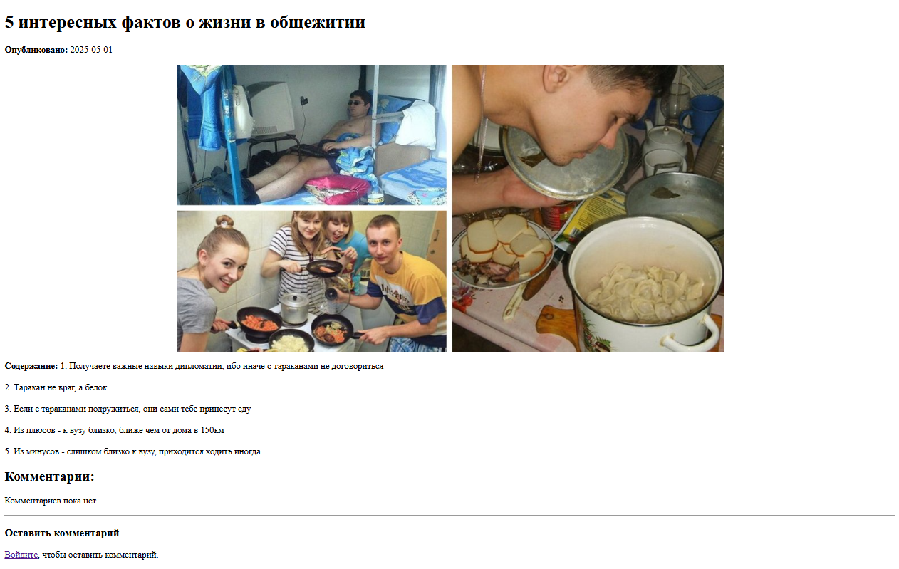
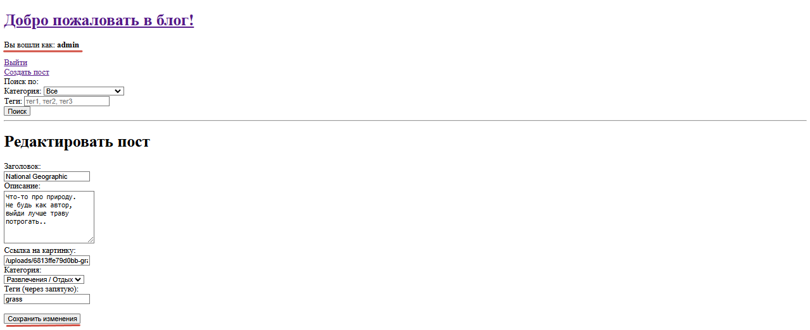
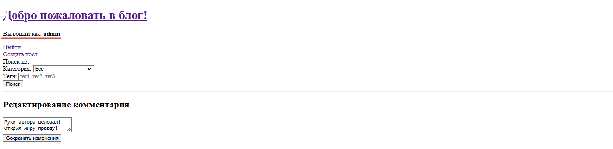
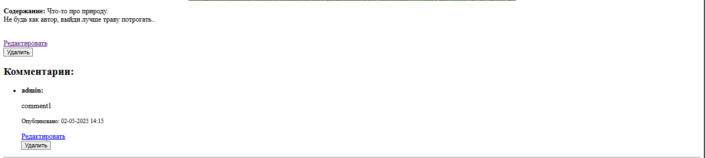
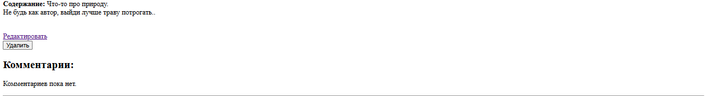
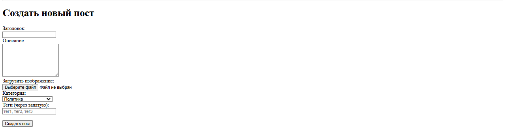
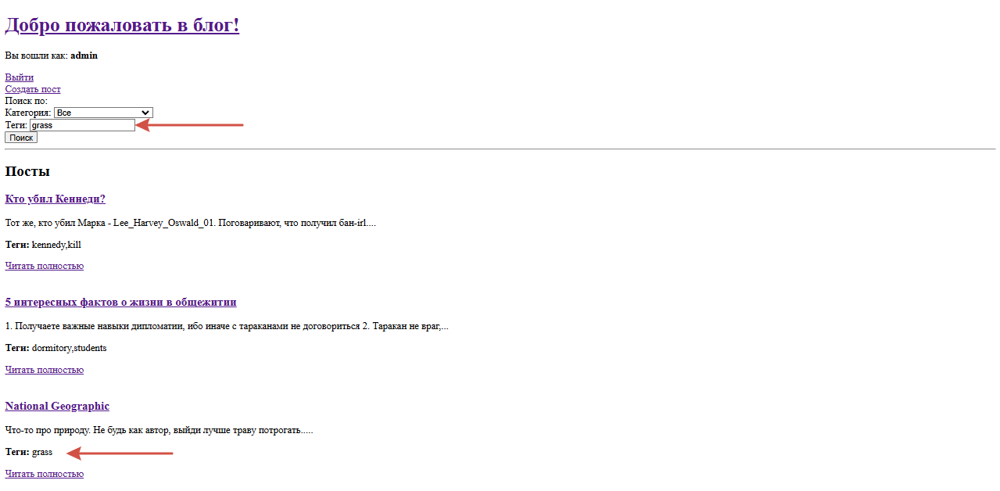
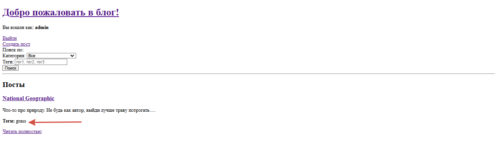

# Индивидуальная работа  

**Тема:** Разработка REST-API приложения "Блог"

## Описание работы

Целью данной работы являлась разработка веб-приложения — блога, который поддерживает добавление, просмотр, редактирование, удаление статей, а также возможность оставлять комментарии.

В ходе проекта были закреплены навыки разработки REST API, взаимодействия с реляционными и документно-ориентированными базами данных, а также применены знания, полученные в течение учебного семестра.

## Документация проекта

Приложение реализовано на PHP с использованием PostgreSQL и MongoDB.

### Краткое содержание

Проект представляет собой личный блог, в котором администратор (автор) публикует статьи. Пользователи могут просматривать и комментировать статьи, а также искать их по категориям и тегам. Комментирование доступно только зарегистрированным пользователям.

### Основные сущности

**1. Пользователь**  
Пользователь может иметь одну из двух ролей:

- `user` — зарегистрированный пользователь
- `admin` — администратор, Царь и Бог данного блога (Гуцу Николай)

**2. Статья**  
Только администратор может публиковать статьи. Статья содержит:

- заголовок
- дату публикации
- изображение
- содержание
- теги
- комментарии
- форму для добавления комментариев

### Компоненты приложения

**1. Общедоступный (гость):**

- Просмотр постов
- Поиск по тегам и категориям
- Аутентификация

**2. Частично защищённый (`user`):**

- Возможность оставлять комментарии

**3. Защищённый (`admin`):**

- Создание, редактирование, удаление постов
- Редактирование, удаление комментариев
- Добавление новых администраторов

## Структура базы данных

Используются две СУБД:

### PostgreSQL

- `users` — информация о пользователях
- `posts` — статьи
- `categories` — статичные категории
- `tags` — теги
- `post_tags` — связи между постами и тегами

### MongoDB

Комментарии хранятся в отдельной коллекции:

- `id` — ID комментария
- `post_id` — ID поста
- `user_id` — ID пользователя
- `content` — текст комментария
- `created_at` — дата публикации

## Примеры интерфейса

1. Главная страница  
   

2. Регистрация  
   

3. Просмотр статьи  
   

4. Редактирование поста  
   

5. Редактирование комментария  
   

6. Удаление комментария  
     
   

7. Создание поста  
   

8. Работа формы поиска  
     
   

## Безопасность

- Использование `PDO` и подготовленных выражений
- Защита от XSS через `htmlspecialchars()`
- Контроль доступа по ролям
- Хэширование паролей
- Работа через сессии

## Инструкция по запуску проекта

1. Клонируйте репозиторий:

   ```bash
   git clone https://github.com/yourusername/blog-project.git
    ```

2. Создайте структуру базы данных PostgreSQL с помощью скрипта `create_db_script.php`.
3. Установите MongoDB: `https://www.mongodb.com/try/download/community`.
4. Проверьте, что в `php.ini` включены расширения:
    - pdo_pgsql
    - pgsql
    - mongodb
  
   Если MongoDB-расширение не установлено:
    - `pecl install mongodb`
    - Или загрузите [`php_mongodb.dll`](https://windows.php.net/downloads/pecl/releases/mongodb/1.13.0/) поместите `php_mongodb.dll` в `php/ext` и подключите в `php.ini`. Убедитесь, что PHP версии ≤ 8.1
5. Установите зависимости через Composer командами `composer install` & `composer require mongodb/mongodb`
6. Создайте файл `config/db.php` со следующими параметрами:
    - `define('DB_HOST', 'localhost');`
    - `define('DB_NAME', 'blog');`
    - `define('DB_USER', 'YOUR_USERNAME');`
    - `define('DB_PASS', 'YOUR_PASSWORD');`
    - `define('DB_PORT', '5432');`
7. Запустите сервер командой `php -S localhost:8000 -t public`.

## Выводы

В результате работы было создано функциональное REST-API веб-приложение, соответствующее целям индивидуального задания. Проект демонстрирует уверенное владение PHP, базами данных PostgreSQL и MongoDB, архитектурой MVC и основами безопасности.

## Библиография

`https://pecl.php.net/package/mongodb`
`https://moodle.usm.md/course/view.php?id=7161`
`https://zudochkin.github.io/2011/08/mongodb-php/`
`https://dataguide.vercel.app/dataguide/mongodb/working-with-dates`
